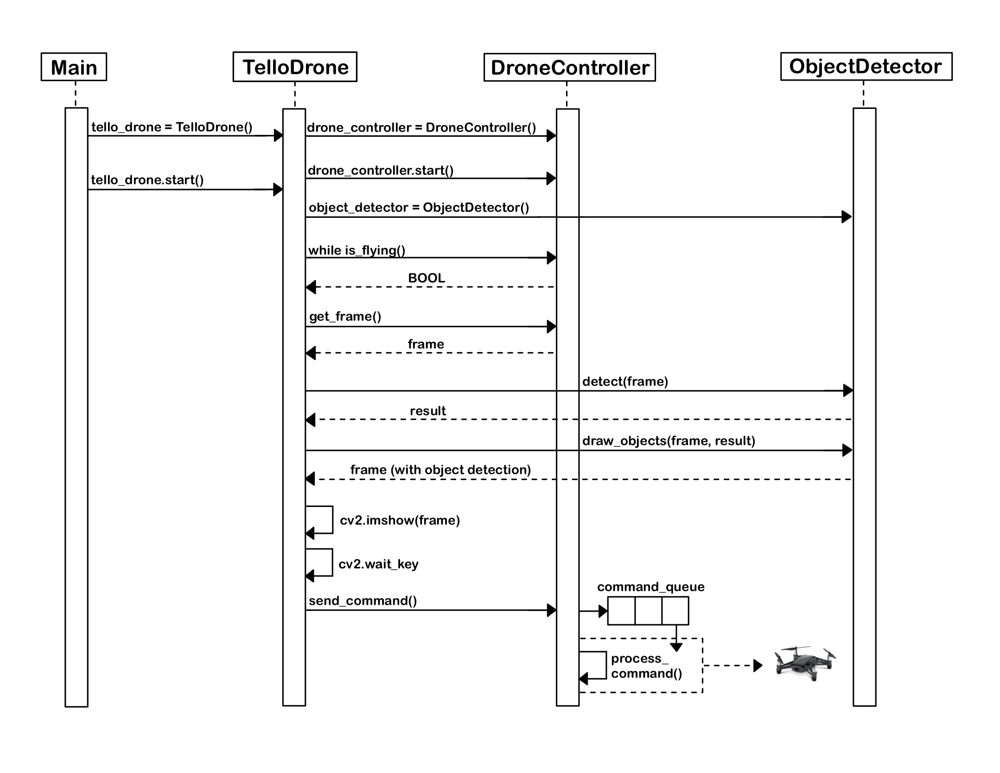

# Drone Mission: Classify the world around you!

---
Hi there! My name is Rebecca, and I’m a Computer Science student at Foothill College. I decided to experiment with Robotics 
and Artificial Intelligence by working on this small project. I’m using a DJI Tello Drone and Google’s MediaPipe open source framework to develop a drone mission control application. I enhanced the drone’s vision by adding object detection, utilized threading to process commands coming 
from my own computer, and learned how to create a video writer to save the mission recordings. 

## Application Design

### TelloDrone Class
Responsible for managing the mission. Creates DroneController and ObjectDetector objects while using OpenCV to record the video stream coming from the drone.

### TelloController Class
Responsible for processing navigation commands from the user and sending them to the drone. Utilizes threading and queues to control the drone with smooth operation and minimal delay.  

### ObjectDetector Class
Responsible for object detection using Google’s MediaPipe framework. Creates a detector that classifies objects in a live stream and draws boxes around the objects. 

**Below is a UML Diagram that encompasses most of the functionality of Drone Mission!**


## How to Run!

- Open a terminal, navigate to the drone_mission directory 
- Activate a virtual environment

```
python3.12 -m venv venv

source venv/bin/activate
```
- Install required packages

`pip install -r requirements.txt`

- Connecting to drone
  - The Tello drone connects to your computer using a hotspot

## Example Mission

